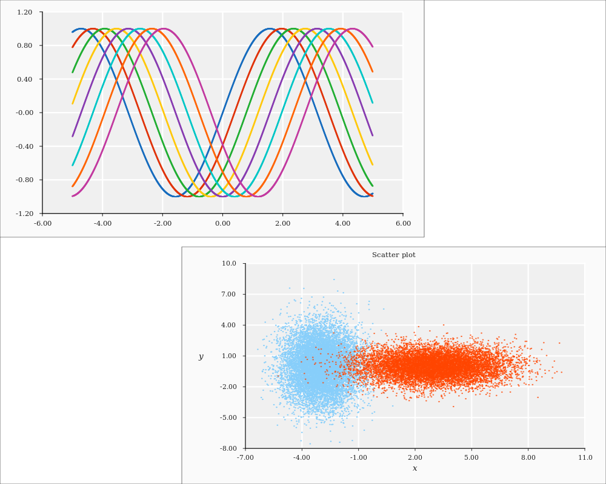

# Astrup

A rust plotting library using [gtk-rs](https://github.com/gtk-rs/gtk) as a backend. This is *still*
very much a small hobby project. I believe it is ok for simple use, but lots of changes (also
breaking ones) should be expected.

For alternative rust plotting libraries, see e.g.

- [rustplotlib](https://github.com/ubnt-intrepid/rustplotlib)
- [RustGnuplot](https://github.com/SiegeLord/RustGnuplot)
- [dataplotlib](https://github.com/coder543/dataplotlib)


## Build:

- [Install rust](https://www.rust-lang.org/en-US/install.html), and make sure `~/.cargo/bin/` is in
  your `PATH`.
- Make sure you have **GTK+**, **GLib**, and **Cairo** development files on your system.
  Install instructions can be found [here](http://gtk-rs.org/docs/requirements.html).
- Clone the repository, and build with `cargo build`.

## Gloals:
- Plot data from multiple containers (first priority: `Vec` and `ndarray`).
- Building plots should be intuitive.
- Plots should look nice and informative.
- It should be very configurable.

## Planned charts

The table below lists, by priority, the planned chart variants. Currently, only simple scatter and
line plots are implemented.

| Variant        | Implemented |
| -------------- | ----------- |
| Scatter        | Partially   |
| Line           | Partially   |
| Histogram      | No          |
| Matrix heatmap | No          |
| Image          | No          |
| Filled curve   | No          |
| Box plot       | No          |
| Pie charts     | No          |

## Example

```rust
extern crate ndarray;
extern crate rand;
extern crate astrup;

use std::f64::consts::PI;

use ndarray::Array;
use rand::distributions::{IndependentSample, Normal};
use rand::{thread_rng};

use astrup::view::View;
use astrup::figure::Figure;
use astrup::plot::Plot;
use astrup::chart::Chart;
use astrup::chart::scatter::Scatter;
use astrup::chart::line::Line;

fn main() {

    // Create data contained in ndarray
    let x_data = Array::from_iter((0..100).map(|x| (x as f64) * 2.0 * PI / 100.0));
    let y_data1 = Array::from_iter((0..100).map(|i| x_data[i].sin()));
    let y_data2 = Array::from_iter((0..100).map(|i| (x_data[i] - PI / 2.0).sin()));

    // Plot lines
    let line1 = Line::new(&x_data, &y_data1).set_stroke_style("dotted");
    let line2 = Line::new(&x_data, &y_data2).set_color_rgba(0.9, 0.2, 0.2, 0.9);

    // Add lines to a plot
    let line_plot = Plot::new().add(Chart::Line(line1))
                               .add(Chart::Line(line2))
                               .set_y_min(-1.2)
                               .set_local_frame(0.0, 0.7, 0.51, 1.0);

    // Create scatter points
    let normal_0_1 = Normal::new(0.0, 1.0);
    let normal_0_2 = Normal::new(0.0, 2.0);
    let x_data: Vec<f64> = (0..1000)
                           .map(|_| normal_0_1.ind_sample(&mut thread_rng()))
                           .collect();
    let y_data: Vec<f64> = (0..1000)
                           .map(|_| normal_0_2.ind_sample(&mut thread_rng()))
                           .collect();
    let scatter = Scatter::new(&x_data, &y_data).set_color_rgba(0.1, 0.8, 0.3, 0.9)
                                                .set_point_size(0.005);

    // Add scatter points to a new plot
    let scatter_plot = Plot::new().set_local_frame(0.3, 1.0, 0.0, 0.49)
                                  .add(Chart::Scatter(scatter));

    // Add the plots to a figure, and save it
    let fig = Figure::new().add(line_plot)
                           .add(scatter_plot)
                           .set_width(1000)
                           .set_height(800)
                           .set_border_thickness(0.001)
                           .save("assets/frontpage_example.png").expect("Could not save frontpage_example.png");

    // Display the result on screen
    View::new_from(fig).expect("Could not add figure to view")
                       .show();
}
```


