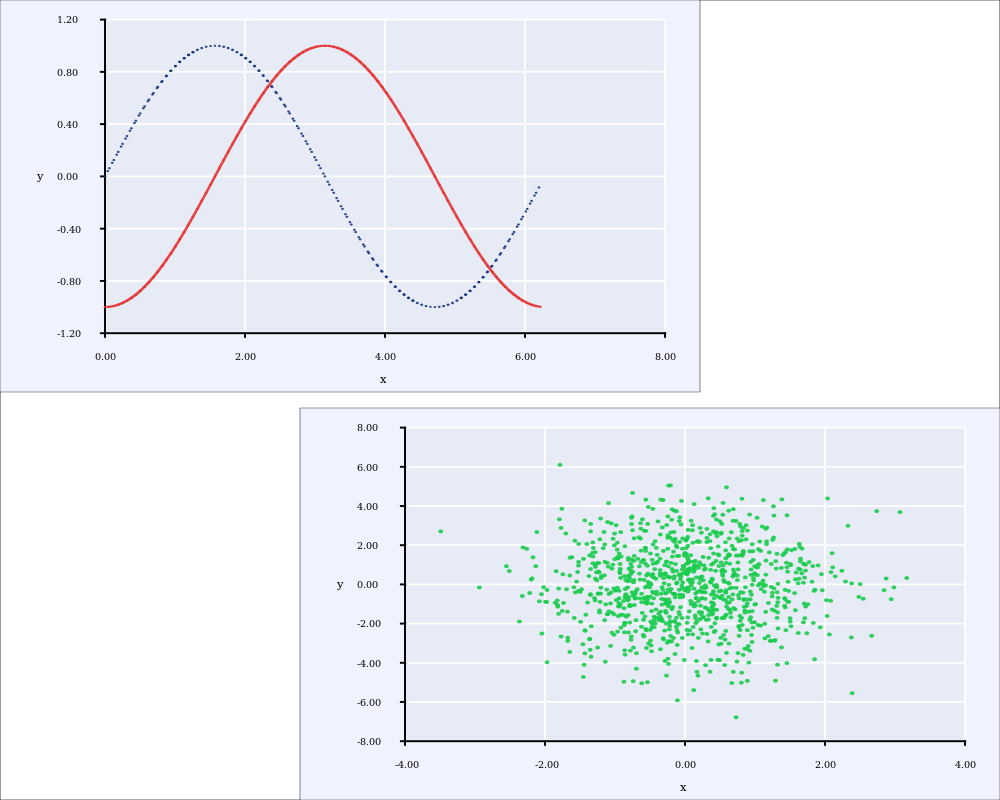

# astrup

A rust plotting library using [gtk-rs](https://github.com/gtk-rs/gtk) as a backend. This is
*still* very much a small hobby project. For alternative rust plotting libraries, see e.g.

- [rustplotlib](https://github.com/ubnt-intrepid/rustplotlib)
- [RustGnuplot](https://github.com/SiegeLord/RustGnuplot)
- [dataplotlib](https://github.com/coder543/dataplotlib)

## Example

```rust
extern crate ndarray;
extern crate rand;
extern crate astrup;

use std::f64::consts::PI;

use ndarray::Array;
use rand::distributions::{IndependentSample, Normal};
use rand::{thread_rng, Rng};

use astrup::view::View;
use astrup::figure::Figure;
use astrup::plot::Plot;
use astrup::chart::Chart;
use astrup::chart::scatter::Scatter;
use astrup::chart::line::Line;

fn main() {

    // Create data contained in ndarray
    let x_data = Array::from_iter((0..100).map(|x| (x as f64) * 2.0 * PI / 100.0));
    let y_data1 = Array::from_iter((0..100).map(|i| x_data[i].sin()));
    let y_data2 = Array::from_iter((0..100).map(|i| (x_data[i] - PI / 2.0).sin()));

    // Plot lines
    let mut line1 = Line::new(&x_data, &y_data1);
    line1.set_stroke_style("dotted");
    let mut line2 = Line::new(&x_data, &y_data2);
    line2.set_color(0.9, 0.2, 0.2, 0.9);

    // Add lines to a plot
    let mut line_plot = Plot::new();
    line_plot.add(Chart::Line(line1));
    line_plot.add(Chart::Line(line2));
    line_plot.set_y_min(-1.2);
    line_plot.set_local_frame(0.0, 0.7, 0.51, 1.0);

    // Create scatter points
    let normal_0_1 = Normal::new(0.0, 1.0);
    let normal_0_2 = Normal::new(0.0, 2.0);
    let x_data: Vec<f64> = (0..1000)
                           .map(|_| normal_0_1.ind_sample(&mut thread_rng()))
                           .collect();
    let y_data: Vec<f64> = (0..1000)
                           .map(|_| normal_0_2.ind_sample(&mut thread_rng()))
                           .collect();
    let mut scatter = Scatter::new(&x_data, &y_data);
    scatter.set_color(0.1, 0.8, 0.3, 0.9);
    scatter.set_point_size(0.005);

    // Add scatter points to a new plot
    let mut scatter_plot = Plot::new();
    scatter_plot.add(Chart::Scatter(scatter));
    scatter_plot.set_local_frame(0.3, 1.0, 0.0, 0.49);

    // Add the plots to a figure, and save it
    let mut fig = Figure::new();
    fig.add(line_plot);
    fig.add(scatter_plot);
    fig.save("frontpage_example.png").expect("Could not create frontpage_example.png");

    // Display the result on screen
    let view = View::new_from(fig).expect("Could not add figure to view");
    view.show();
}
```



## Gloals:
- Input `Vec` and `ndarray` containers and slices
- It should be intuitive to build plots, but not as "easy as possible". It will probably be
quite verbose and explicit.
- Very configurable.
